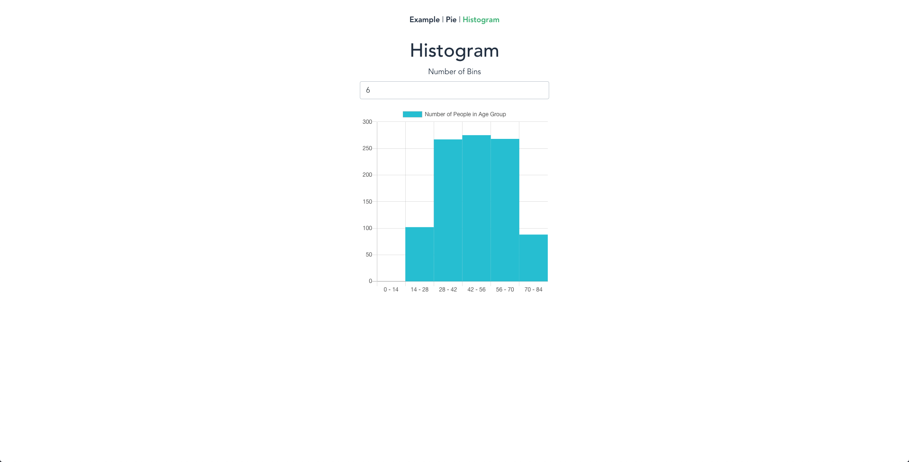

# BRD Interview Packet

Expected Completion time (4-8 hours)  
Inside this repo is a simple Node.js server and Vue.js single page app that is partially completed. Your task is to complete the application based on the requirements below. 

# Requirements To Complete The Application
On the backend:  
 - Load the provided data.csv into the database table people_data  
 - Provide necessary API endpoints for querying the data as you see fit

On the frontend:  
 - Create a histogram of the ages of people contained in the dataset   
 - Create a form to insert a new row into people_data through a POST call  
 - Display all the people in a meaningful way (perhaps a table)  
 - **Add your own flair to the webpage**   
 Feel free to use any necessary libraries, but be prepared to explain your choices


## Running the server

Prerequisites:
 - [Node.js and NPM](https://nodejs.org/en/)

After downloading this repo, run the following to install all required dependencies:

```
npm install
cd frontend/
npm install
```

Then to run the [express](https://expressjs.com/) server, run:
```
npm start
```
This will also automatically redeploy the server when changes are made.  
To automatically recompile the frontend when changes are made, in another terminal run:
```
cd frontend/
npm run build -- --mode dev --watch
```

The webapp should now be accessible at [http://localhost:3000](http://localhost:3000)

## Making changes

Feel free to structure your code however you wish, but you will likely wish to utilize the Vue.js components in `frontend/src/views/` which have already been created.
The project already includes a sample API endpoint and associated Vue.js component for your reference

## Examples




## Helpful tips
####SQL
We're going to be using [Sqlite3](https://www.npmjs.com/package/sqlite3) as our in memory relational database for this project. 
You're going to need to read in data from data.csv using whatever methods you'd like. 
Given is an example table that showcases the basic syntax for creating a table in Sqlite3. 
You're going to have to duplicate and modify this to store the data in data.csv.
```sql
CREATE TABLE `table_name` (
    column1 TEXT,
    column2 INT
);
```
To populate your table, you can accomplish this with two different methods.
```sql
INSERT INTO `table_name` ('column1', 'column2') VALUES (value1, value2);

INSERT INTO `table_name` VALUES (value1, value2); 

```
Note that your values MUST match the data type defined in your create. 
The second method is shorthand for inserting values in the order that they are defined (the number of values inserted must match the number of values defined).

To retrieve data from your table, you can use the following commands base on which attributes you want.
```sql
SELECT * FROM `table_name`;

SELECT column1, column2 FROM `table_name`;

#provides an alias for column1  
SELECT column1 as data FROM `table_name`;
```

####Express
[Express](https://expressjs.com/) will the be the backend server that your frontend will interact with.
You can find the code for the express server inside index.js. 
Here we will be defining our [REST](https://en.wikipedia.org/wiki/Representational_state_transfer) server.
To create a GET endpoint use the following code:
```javascript
//access at url localhost:3000/sum?x=1&y=2
app.get('/sum', (req,res)=>{
    let x = req.query.x;
    let y = req.query.y;

    //some kind of computation
    let z = x + y;

    res.send('' + z)
});
```
To access the endpoints defined in your backend use the [fetch](https://developer.mozilla.org/en-US/docs/Web/API/Fetch_API) method.
```javascript
fetch('http://localhost:3000/sum?x=1&y=2').then(result=>{
    return res.json();
}).then(data => {
    //3
    console.log(data);
});
```

You may want to research Promise based/callback asynchronous calls if you do not understand the syntax. 
####Vue
The file structure is organized into three folders: Views, Containers, and Components.
Views contain the page to be rendered by the router. This is where you should place your containers or components.
Containers are a wrapper around your components. They usually handle the fetching and sending of data. 
Components are parts to be rendered on the page, they should be reusable, flexible, and not dependent on the data passed in through props.  

Provided to you is the pie chart. The view will work once you populate the people_data table. 
Use this as a reference point when creating your histogram. The library being used is [vue-chartjs](https://vue-chartjs.org/), a vue wrapper for [chart.js](https://www.chartjs.org/)

You may find that you need to create N number of components base on the data in some list. 
Take a look at Example.vue if you get stuck.


